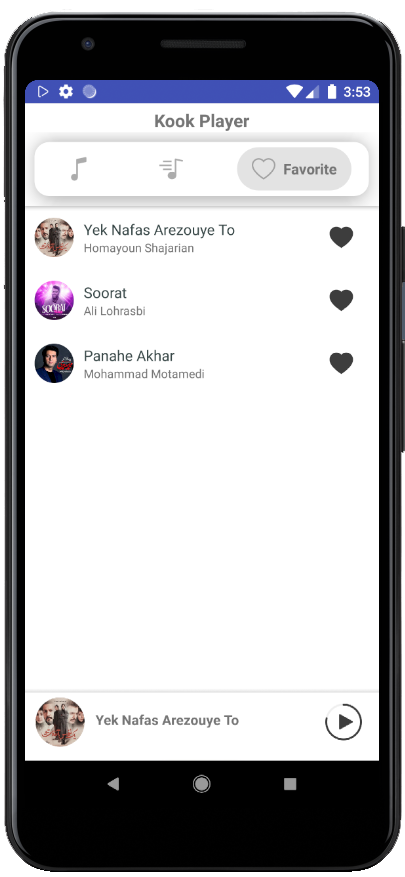
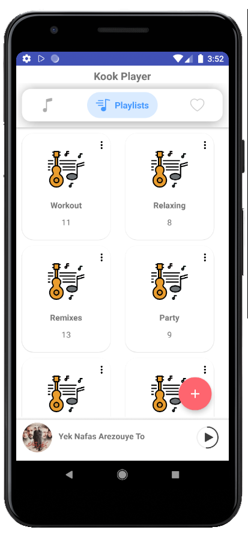
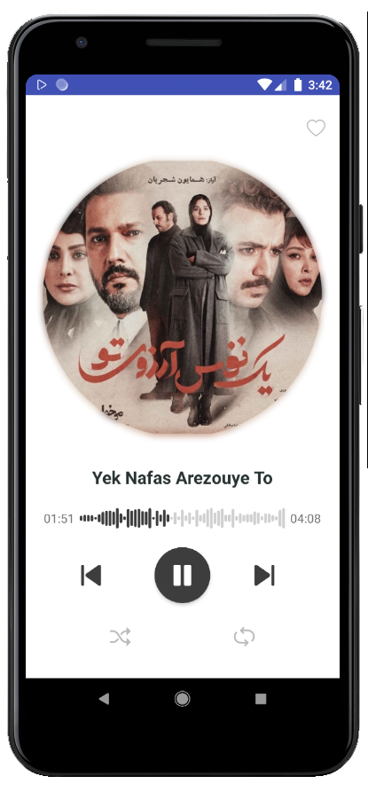

# Kook Player 

Kook Player is a simple and small music player, with features such as creating playlists, adding music to favorites, controlling music through notifications, and more.

## 📷 Screenshots 

 |  |  
|:---:|:---:|:---:|
|Main Page| Add Song To Playlist | Favorites|

|  | 
|:---:|:---:|
|Playlists| Player Panel

### 📄 License

Kook Player is released under the MIT License, which can be found [here](https://github.com/MahboubehSeyedpour/Kook-Player/blob/master/LICENSE)
